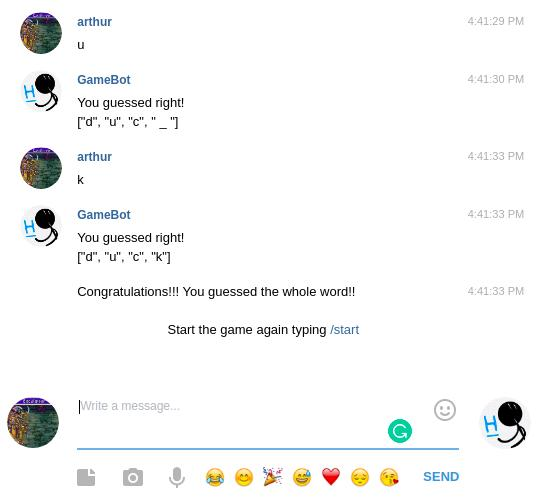

# Gamebot

> A Telegram bot that plays a guess game with you!

## Built With

- Git
- Github
- GitFlow
- VSCode
- Ruby
- Telegram
- Telegram-Bot-Ruby
- Sinatra
- Rubocop
- Dotenv
- KolourPain
- Ubuntu 20.04
- Heroku 

## Live Demo

[Play with a Live Bot in Telegram!](https://t.me/Just_guess_bot)

## Getting Started

To get a local copy up and running follow these simple example steps.

### Prerequisites

- Own a Telegram Account
- Clone the repository: `git clone git@github.com:arthurborgesdev/gamebot.git` 

### Setup

- Access @BotFather in Telegram
- Register a new bot typing `/newbot`
- Set a name for it
- Set a username for it
- You will receive a Token and a Bot Link 
- Use the Bot Link to access your recently created Bot
- Create a file named `.env` in the root of the project with `BOT_TOKEN=YourTokenHere` writen in it  

### Install

- run `bundle install` to install the dependencies

### Run tests

- run `rspec -f d` to run tests in the documentation format

### Deployment

- run `ruby bin/main.rb` from your local machine to start your bot

Alternatively, you can use a already deployed version of the bot in Heroku: 

[Play with a Live Bot in Telegram!](https://t.me/Just_guess_bot)

### Usage

- Access your recently created bot by its Bot Link or the already deployed Bot
- Start the bot by entering the command `/start`
- Try to guess the word by entering one letter at a time until all letters are filled up
- When you finish the word, the bot will Congratulate you!
- Enter `/start` to try another word or `/stop` to end the game

## Author

👤 **Arthur Borges**

- GitHub: [@arthurborgesdev](https://github.com/arthurborgesdev)
- Twitter: [@arthurmoises](https://twitter.com/arthurmoises)
- LinkedIn: [Arthur Borges](https://linkedin.com/in/arthurmoises)

## 🤝 Contributing

Contributions, issues, and feature requests are welcome!

Feel free to check the [issues page](https://github.com/arthurborgesdev/gamebot/issues).

## Show your support

Give a ⭐️ if you like this project!

## Acknowledgments

- Telegram
- Telegram-bot-ruby
- Friends
- Groups of games in Telegram

## 📝 License

This project is [MIT](./LICENSE) licensed.
